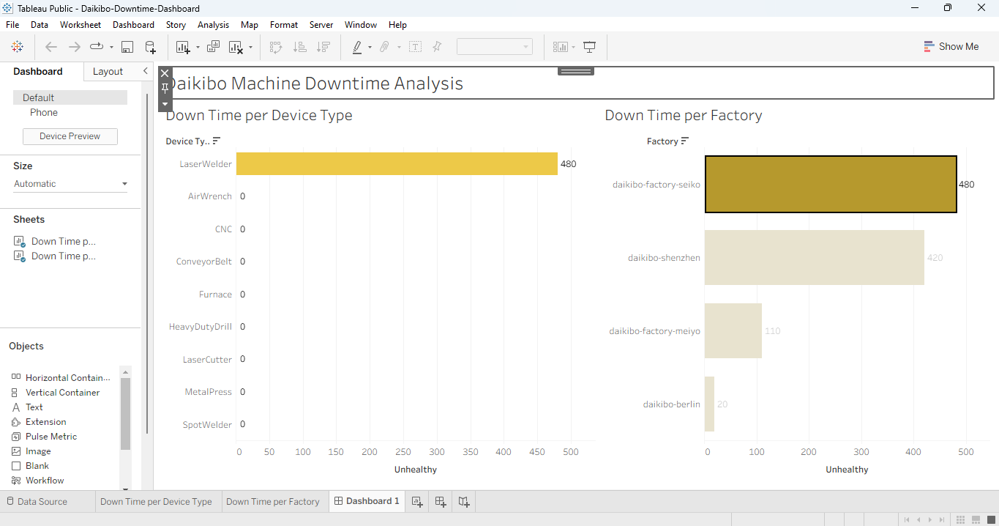

# Deloitte Australia Data Analytics Simulation

## Project Overview

This project was completed as part of the Forage Data Analytics Virtual Experience Program with Deloitte Australia.

The objective was to analyze operational data, identify inefficiencies, and generate actionable insights using data visualization and classification techniques.

### Dashboard Preview

The interactive dashboard below shows machine downtime by factory and device type:

## Objectives
- Analyze machine downtime across multiple factories
- Identify high-risk machine types contributing to operational inefficiencies
- Classify equality scores into meaningful categories
- Present insights using data visualization tools

## Tools Used
Tableau: for data visualization and dashboard creation

Microsoft Excel: for data cleaning and classification

## Dataset Description
The dataset consisted of machine telemetry data recorded at 10-minute intervals. It included:-
- Device ID and Device Type
- Machine Status (healthy/unhealthy)
- Timestamp
- Temperature readings
- Factory and location details

A separate dataset contained equality scores, which required classification.

## Methodology
🔹 Task 1: Data Visualization (Tableau)
- Imported JSON dataset into Tableau
- Expanded nested schema to structure the data
- Created a calculated field:

IF [Status] = "unhealthy" THEN 10

ELSE 0

END.

- Built visualizations:

Downtime per Factory

Downtime per Device Type

Developed an interactive dashboard with filtering capabilities

🔹 Task 2: Data Classification (Excel)
- Created a new column: Equality Class
- Applied IF logic to categorize equality scores:

=IF(ABS(C2)<=10,"Fair",

IF(AND(C2>-20,C2<-10),"Unfair",

IF(OR(C2<=-20,C2>=20),"Highly Discriminative","")))

- Updated and submitted the dataset

## Key Insights
- Certain factories experienced significantly higher downtime than others
- The Laser Welder machine type recorded the highest downtime
- Equality scores were successfully categorized into:
Fair, Unfair, and Highly Discriminative

## Recommendations
- Implement preventive maintenance for high-downtime machines
- Conduct root cause analysis on frequently failing equipment
- Use dashboards for continuous performance monitoring
- Standardize classification methods for better data interpretation

## Key Learnings
- Practical experience in data visualization using Tableau
- Application of logical functions in Excel for data classification
- Importance of transforming raw data into actionable insights
- Ability to communicate findings effectively

## Project Output
Interactive Tableau Dashboard

Cleaned and classified dataset (Excel)

Analytical report summarizing findings and recommendations

## About
This project demonstrates foundational skills in data analysis, including data preparation, visualization, and insight generation. It reflects my growing ability to work with real-world datasets and deliver data-driven solutions.

⭐ If you found this project interesting, feel free to connect or share feedback!
